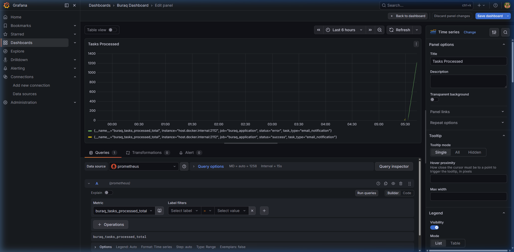

# Buraq Task Queue


Buraq is a highly concurrent, resilient distributed task queue built with **Go** and **Redis Streams**. It provides robust capabilities out of the box for handling asynchronous jobs, scaling workers, and managing failures seamlessly through automatic retries and a Dead-Letter Queue (DLQ).

If a worker crashes or fails, the task is automatically re-queued up to a configurable retry limit before being isolated to a dedicated Dead-Letter Queue (`buraq_tasks_dlq`) for inspection and manual replay.



---

## ✨ Features

| Feature | Description |
|---|---|
| **Concurrent Worker Pool** | Spin up a configurable pool of goroutines to process tasks in parallel without blocking. |
| **Automatic Retries** | Failing tasks are transparently re-queued up to a per-task `MaxRetries` limit. |
| **Dead-Letter Queue** | Poison-pill tasks that exhaust all retries are routed to an isolated DLQ stream for safe inspection. |
| **DLQ Replay** | Re-enqueue all DLQ tasks back into the main stream with a single API call — retries reset to zero. |
| **Graceful Shutdown** | Intercepts `SIGINT`/`SIGTERM`, stops the fetch loop, and lets in-flight workers drain cleanly before exiting. |
| **Real-Time Event Stream** | Server-Sent Events (SSE) endpoint broadcasts task lifecycle events via Redis Pub/Sub. |
| **Prometheus Metrics** | Exposes task throughput, failure rates, DLQ counts, processing duration, worker panics, and idempotency stats at `/metrics`. |
| **Redis Streams Backed** | Built on Redis 5.0+ Streams using `XADD`, `XREADGROUP`, and `XACK` — persistent, ordered, and consumer-group-aware. |
| **Priority Queues** | Route tasks to high/normal/low priority streams. Consumer reads high-priority first. |
| **Idempotency Keys** | Prevent duplicate task processing with Redis-backed idempotency checks (24h TTL). |
| **Task Timeouts** | Per-task timeout support via `context.WithTimeout`. |
| **Rate Limiting** | API endpoints protected with per-IP token bucket rate limiting. |
| **Health Checks** | `GET /api/health` returns Redis connectivity and uptime. |
| **API Key Auth** | DLQ replay endpoint protected by Bearer token authentication. |
| **Redis Cluster** | Optional Redis Cluster support for horizontal scaling. |
| **Docker Ready** | Multi-stage Dockerfile + docker-compose with Redis, Prometheus, and Grafana. |
| **CI/CD Pipeline** | GitHub Actions workflow with lint, test, build, and Docker image verification. |
| **Testable Architecture** | Interfaces for all dependencies — unit testable without a live Redis. |

---

## 📊 Performance

Benchmarked on a single node against a local Redis instance (AMD Ryzen 5 3600, Windows):

| Metric | Result |
|---|---|
| **Throughput** | **13,356 tasks/sec** (publish) |
| **p99 Enqueue Latency** | 582ms under 10,000 concurrent goroutines |
| **Workers** | 50 concurrent goroutines |
| **Tasks** | 10,000 concurrent enqueues |
| **Total Time** | ~0.75 seconds |

Run it yourself:

```bash
# Requires Redis running on localhost:6379
go test -v -run=^$ -bench=BenchmarkBuraqQueue -benchtime=1x ./benchmarks/
```

---

## 🏗 Architecture

```
Producer (XADD)
     │
     ▼
Redis Stream (buraq_tasks)          ┌── buraq_tasks_high (priority)
     │                              ├── buraq_tasks      (normal)
     ▼                              └── buraq_tasks_low   (priority)
Consumer Group (XREADGROUP)
     │
     ├── Idempotency Check (SET NX)
     ├── Worker 1 ──► Process ──► XACK  ──► ✅ Success
     ├── Worker 2 ──► Process ──► Retry ──► Re-queue (up to MaxRetries)
     └── Worker N ──► Process ──► DLQ   ──► buraq_tasks_dlq

All state changes ──► Redis Pub/Sub (buraq_events) ──► SSE API ──► Dashboard
```

### Key Design Decisions

- **Interface-based**: `StreamStore`, `EventPublisher`, `TaskProcessor`, `IdempotencyChecker` — every dependency is injectable and mockable
- **Structured logging**: `log/slog` with JSON output for production, human-readable for development
- **Configuration via env vars**: All hardcoded values replaced with environment variables and sensible defaults
- **Graceful everywhere**: Context propagation from signal handler through fetcher, workers, API server, and metrics server

---

## 📁 Project Structure

```
buraq/
├── main.go                 # Entry point: config, wiring, signal handling
├── config/
│   └── config.go           # Environment-based configuration
├── task/
│   ├── task.go             # Task & Event struct definitions
│   └── store.go            # Interfaces: StreamStore, EventPublisher, TaskProcessor, IdempotencyChecker
├── producer/
│   ├── producer.go         # Enqueues tasks via StreamStore
│   └── priority.go         # Priority-aware producer (routes to _high/_low streams)
├── consumer/
│   ├── consumer.go         # Worker pool: fetch, process, retry, DLQ
│   └── priority_consumer.go # Priority-aware consumer (reads high-first)
├── api/
│   ├── server.go           # REST + SSE API server (graceful shutdown)
│   └── middleware.go       # CORS, API key auth, panic recovery, rate limiting
├── event/
│   └── publisher.go        # Redis Pub/Sub event publisher
├── redisadapter/
│   ├── adapter.go          # StreamStore implementation for Redis standalone
│   ├── cluster.go          # StreamStore implementation for Redis Cluster
│   └── idempotency.go      # IdempotencyChecker implementation (SET NX)
├── metrics/
│   └── metrics.go          # Prometheus metric collectors
├── tests/
│   └── integration_test.go # Integration tests (requires Redis)
├── benchmarks/
│   └── benchmark_test.go   # Producer-side benchmark
├── dashboard/              # Next.js frontend
├── docs/                   # Deep-dive documentation guides
├── Dockerfile              # Multi-stage Go build
├── docker-compose.yml      # Redis + Prometheus + Grafana + Buraq
├── prometheus.yml          # Prometheus scrape config
└── .github/workflows/
    └── ci.yml              # GitHub Actions CI pipeline
```

---

## 🚀 Getting Started

### Prerequisites

- **Go 1.24+**
- **Docker & Docker Compose** (for the local Redis / Prometheus / Grafana stack)
- **Node.js 20+** (only if running the dashboard)

### Quick Start (Docker)

```bash
docker-compose up -d
```

This starts everything — Redis, Prometheus, Grafana, and Buraq itself:

- **Buraq API** on `http://localhost:8080`
- **Prometheus metrics** on `http://localhost:2112/metrics`
- **Prometheus UI** on `http://localhost:9090`
- **Grafana** on `http://localhost:3000` (default: `admin` / `admin`)

### Manual Setup

#### 1. Start the Infrastructure

```bash
docker-compose up -d redis prometheus grafana
```

#### 2. Run Buraq

```bash
go run main.go
```

Or with custom configuration:

```bash
REDIS_ADDR=localhost:6379 \
WORKER_COUNT=10 \
API_KEY=my-secret-key \
CORS_ORIGINS=http://localhost:3000,https://myapp.com \
go run main.go
```

### 3. Start the Dashboard (Optional)

```bash
cd dashboard
npm install
npm run dev
```

Opens at `http://localhost:3000` — real-time visualization of task flow, worker map, and DLQ management. Connects to the API via SSE.

### 4. Observe

| Endpoint | Description |
|---|---|
| `http://localhost:2112/metrics` | Raw Prometheus metrics |
| `http://localhost:8080/api/stream` | SSE stream of real-time task events |
| `http://localhost:8080/api/workers` | JSON snapshot of current worker status |
| `http://localhost:8080/api/health` | Health check (Redis connectivity + uptime) |
| `http://localhost:9090` | Prometheus UI |
| `http://localhost:3000` | Grafana |
| `http://localhost:3000` | Dashboard (if running) |

---

## ⚙️ Configuration

All configuration is via environment variables:

| Variable | Default | Description |
|---|---|---|
| `REDIS_ADDR` | `localhost:6379` | Redis server address |
| `REDIS_CLUSTER` | `false` | Enable Redis Cluster mode |
| `REDIS_ADDRS` | `localhost:6379` | Comma-separated cluster node addresses |
| `STREAM_NAME` | `buraq_tasks` | Main task stream name |
| `GROUP_NAME` | `buraq_workers` | Consumer group name |
| `CONSUMER_NAME` | `worker_node_1` | This consumer's identity |
| `WORKER_COUNT` | `5` | Number of worker goroutines |
| `FETCH_BATCH_SIZE` | `10` | Messages per XREADGROUP call |
| `BLOCK_TIMEOUT` | `2s` | XREADGROUP blocking duration |
| `API_PORT` | `:8080` | HTTP API server port |
| `METRICS_PORT` | `:2112` | Prometheus metrics port |
| `CORS_ORIGINS` | `http://localhost:3000` | Comma-separated allowed origins |
| `API_KEY` | _(empty)_ | Bearer token for DLQ replay (empty = no auth) |
| `MOCK_TASK_INTERVAL` | `2s` | Interval for mock task production |
| `MAX_RETRIES` | `3` | Default max retries per task |
| `ENABLE_MOCK_TASKS` | `true` | Enable/disable mock task production |
| `ENABLE_PRIORITY` | `false` | Enable priority queue routing |
| `DLQ_STREAM_NAME` | `buraq_tasks_dlq` | Dead-Letter Queue stream name |

---

## 🔌 API Reference

### `GET /api/stream`
Server-Sent Events stream. Emits a JSON event for every task state change.

```
data: {"type":"Pending","task_id":"task-1","worker_id":""}
data: {"type":"Processing","task_id":"task-1","worker_id":"worker_node_1-3"}
data: {"type":"Completed","task_id":"task-1","worker_id":"worker_node_1-3"}
```

Event types: `Pending` · `Processing` · `Completed` · `Failed` · `DLQ`

### `GET /api/workers`
Returns a JSON array of current worker nodes with CPU and memory stats.

### `GET /api/health`
Returns health status and uptime.

```json
{
  "status": "healthy",
  "uptime": "2h34m12s",
  "redis": true
}
```

### `POST /api/retry-dlq`
Moves all tasks in the DLQ back to the main stream with retries reset to zero. Requires `Authorization: Bearer <API_KEY>` header when `API_KEY` is set.

```json
{ "success": true, "retried": 4 }
```

---

## 📚 Documentation

Deep-dive guides covering every concept in the project:

| Guide | What You'll Learn |
|---|---|
| [Architecture](docs/01_architecture.md) | Every component, data flow, and design decision explained |
| [Redis Streams](docs/02_redis_streams.md) | Complete mental model of XADD, XREADGROUP, XACK, PEL, and consumer groups |
| [Concurrency Patterns](docs/03_concurrency_patterns.md) | Worker pools, channels, WaitGroups, context cancellation, and the shutdown dance |
| [Reliability Patterns](docs/04_reliability_patterns.md) | DLQ, retry strategies, at-least-once delivery, and data loss prevention |
| [Building from Scratch](docs/05_building_from_scratch.md) | Step-by-step thinking process to build a task queue from zero |
| [Thinking Like an Engineer](docs/06_thinking_like_an_engineer.md) | Debugging strategies, mental models, code reading, and career growth |
| [Explaining to Anyone](docs/07_explaining_to_anyone.md) | How to communicate technical concepts to any audience |
| [Observability](docs/08_observability.md) | Prometheus, PromQL, Grafana dashboards, SSE, and structured logging |

---

## 🗺 Roadmap

- [x] **Task Timeouts** — Per-task timeout via `context.WithTimeout`
- [x] **Priority Queues** — High/normal/low priority stream routing
- [x] **Idempotency Keys** — Duplicate prevention with Redis SET NX
- [x] **Redis Cluster Support** — Horizontal scaling with cluster mode
- [ ] **Cron / Delayed Jobs** — Schedule tasks for future execution or on a recurring interval
- [ ] **Web Dashboard Auth** — Add authentication to the Next.js dashboard

---

## 🖥️ Dashboard

The Next.js dashboard provides real-time visualization:

- **Task Columns** — Pending, Processing, and DLQ tasks with animated transitions
- **Worker Map** — Interactive React Flow visualization with pulse effects on activity
- **Throughput Stats** — Live TPS and P99 latency from benchmark data
- **DLQ Management** — "Retry All" button to replay failed tasks
- **Auto-Reconnect** — SSE connection automatically retries on disconnect (up to 5 times)

| Feature           | Implementation                          |
| ----------------- | --------------------------------------- |
| Memory-safe       | Tasks capped at 100 (FIFO eviction)     |
| Typed             | Full TypeScript — no `any` types        |
| Configurable URL  | `NEXT_PUBLIC_API_URL` env var           |
| Loading states    | "Connecting..." indicator on startup    |
| Error handling    | "Connection lost" message with retry    |

---

## 🤝 Contributing

Please see [CONTRIBUTING.md](CONTRIBUTING.md) for details on setting up your environment, making changes, and submitting a pull request.

### Running Tests

```bash
# Unit tests
go test ./...

# Integration tests (requires Redis)
go test -v ./tests/

# Benchmarks
go test -v -run=^$ -bench=BenchmarkBuraqQueue -benchtime=1x ./benchmarks/

# Lint
golangci-lint run
```

### Docker

```bash
# Build
docker build -t buraq .

# Run with docker-compose (includes Redis, Prometheus, Grafana)
docker-compose up -d
```
